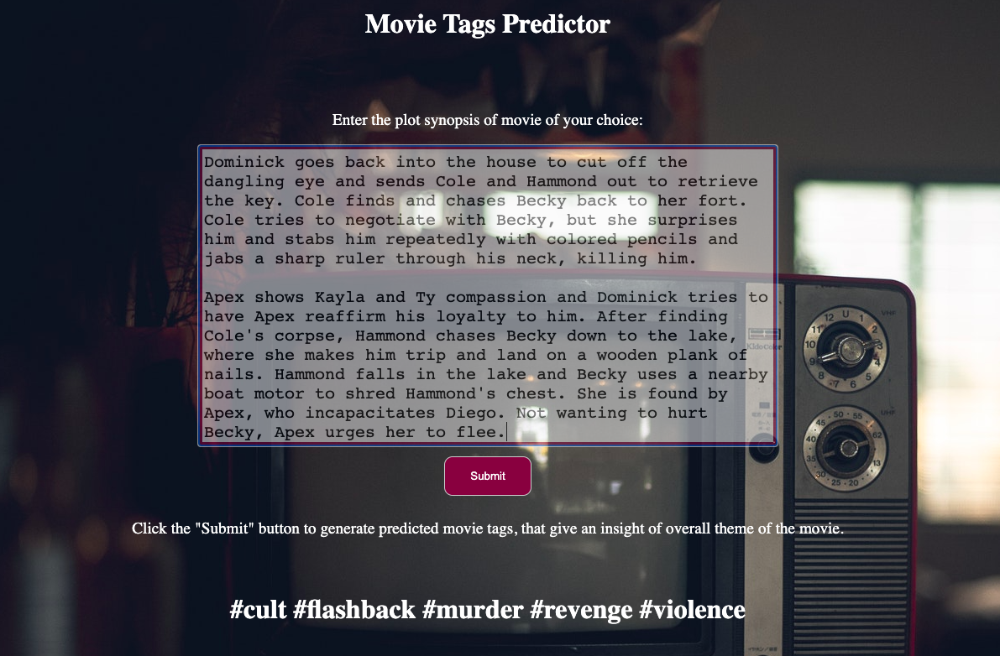

# movie-tags-predictor

This use case is built to predict movie tags when user inputs plot synopsys. It helps to give an overview of the theme of movie. 
To run this:

- First, run the below file. This script downloads the dataset from Kaggle using api and creates a database mpst.db to store the dataset. Later the dataset is cleaned and "CleanedSynopysis" is extracted for training the model. The model is trained to extract maximum of 10 tags from the text provided. eg: suspenseful, violence, murder, flashback, romantic etc. The below file omits a csv file of a dataframe that is processed and is ready to be fed to the model.   
    > **python data-preprocess.py**
    
- Second, run the main.py file. This scripts starts the flask application and will be listening on http://127.0.0.1:5000/. Here, the user can input the plot synopsys of any movie of his choice in the textbox provided. After submitting, below the predicted tags will be displayed. 
    > **export FLASK-APP=main.py** \
    > **export FLASK-ENV=development** \
    > **flask run** 

